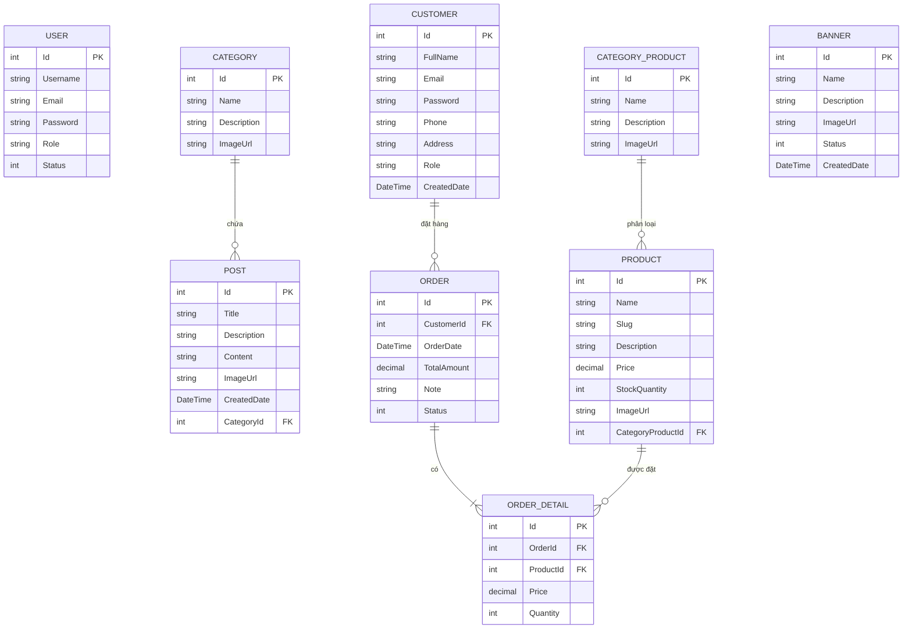
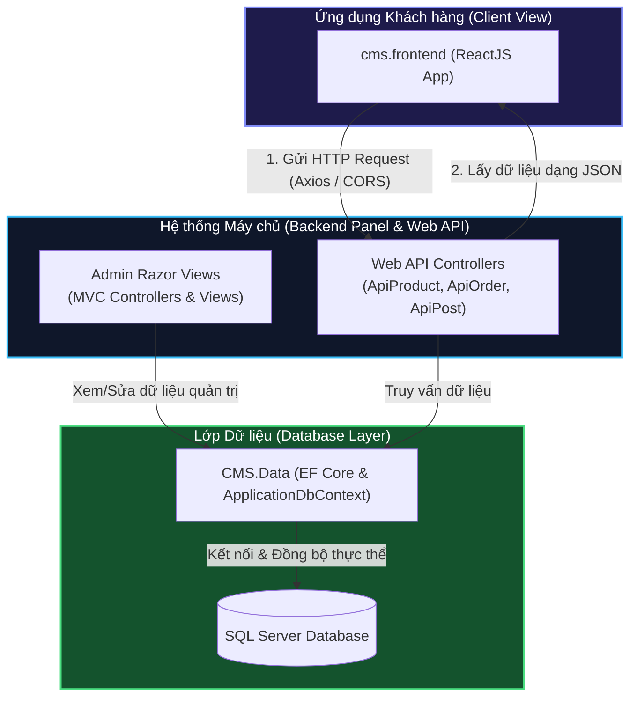
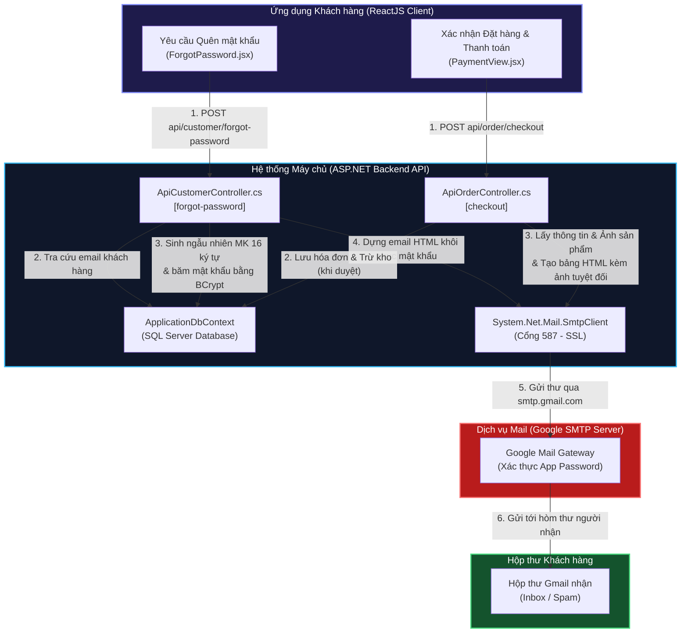

# HỆ THỐNG QUẢN LÝ NỘI DUNG VÀ BÁN HÀNG - CHINHCMS

Hệ thống quản lý nội dung (CMS) và bán hàng được xây dựng trên nền tảng **ASP.NET Core 8.0 MVC** và **Entity Framework Core**. Dự án được thiết kế theo cấu trúc 3 lớp, giúp dễ quản lý, nâng cấp và tích hợp trình soạn thảo văn bản **CKEditor 5** cùng với các tiêu chuẩn thiết kế hiện đại, responsive.

---

## THÔNG TIN SINH VIÊN

- **Sinh viên thực hiện:** Vũ Hoàng Chính
- **Mã số sinh viên:** 2122110380
- **Lớp học:** CCQ2211J
- **Môn học:** Chuyên đề ASP.NET
- **Giáo viên hướng dẫn:** Nguyễn Cao Thái
- **Phiên bản dự án:** 1.0

---

## CẤU TRÚC DỰ ÁN (SOLUTION)

Dự án `ChinhCMS_Solution` được chia làm 3 dự án nhỏ bên trong:

1.  **`CMS.Data` (Lớp dữ liệu)**:
    - Chứa các bảng dữ liệu: `User` (Thành viên), `Category` (Danh mục bài viết), `Post` (Bài viết), `Customer` (Khách hàng), `Product` (Sản phẩm), `CategoryProduct` (Danh mục sản phẩm), `Order` (Đơn hàng), `OrderDetail` (Chi tiết đơn hàng), `Banner` (Quảng cáo/Trình chiếu).
    - Sử dụng `ApplicationDbContext` để kết nối và cấu hình quan hệ giữa các bảng.
2.  **`CMS.Backend` (Trang quản trị)**:
    - Xây dựng bằng ASP.NET Core 8.0 MVC để làm trang quản trị (Admin Panel) cho người điều hành.
    - Gồm các bộ điều khiển (Controllers), giao diện (Views) và tài nguyên tĩnh (hình ảnh, css nằm trong wwwroot).
3.  **`cms.frontend` (Giao diện người dùng)**:
    - Trang hiển thị tin tức cho người xem được viết bằng ReactJS, lấy dữ liệu thông qua API từ Backend.

---

## SƠ ĐỒ QUAN HỆ THỰC THỂ (ERD) & KIẾN TRÚC GIAO TIẾP

### 1. Sơ đồ quan hệ các thực thể (Entity Relationship Diagram - ERD)

Dưới đây là sơ đồ quan hệ giữa các bảng cơ sở dữ liệu trong hệ thống:



### 2. Sơ đồ luồng giao tiếp giữa các thành phần dự án

Mô tả luồng giao tiếp giữa lớp Dữ liệu (`CMS.Data`), Giao diện quản trị & API (`CMS.Backend`) và Ứng dụng khách hàng (`cms.frontend`):



* **Lớp dữ liệu (`CMS.Data`)**: Đóng vai trò là nền tảng quản lý thực thể (Entities) và kết nối trực tiếp với SQL Server qua Entity Framework Core. Cả hai luồng quản trị (MVC) và API đều sử dụng chung `CMS.Data`.
* **Trang quản trị & API (`CMS.Backend`)**: 
  * Cung cấp giao diện Razor hoàn chỉnh cho Admin/Editor quản lý các thực thể.
  * Đồng thời mở cổng giao tiếp Web API (JSON RESTful) và thiết lập CORS để ReactJS có thể truy cập từ xa.
* **Giao diện Client (`cms.frontend`)**: Hoạt động hoàn toàn độc lập ở máy khách (ReactJS), kết nối lấy dữ liệu thông tin, sản phẩm, bài viết và đẩy đơn hàng về server qua Axios.

### 3. Sơ đồ luồng gửi Email hệ thống (Email Communication Flow)

Dưới đây là sơ đồ mô tả luồng gửi email tự động từ ứng dụng Client thông qua hệ thống Backend API kết nối với máy chủ SMTP của Google:



#### Chi tiết Luồng xử lý gửi Email:
1. **Luồng Khôi phục Mật khẩu (Forgot Password)**:
   - **Bước 1 (Client)**: Khách hàng nhập email tại trang `/forgot-password` (được tách thành trang riêng độc lập) và nhấn nút gửi yêu cầu.
   - **Bước 2 (API - Nhận Request)**: Endpoint `POST api/customer/forgot-password` trong `ApiCustomerController.cs` tiếp nhận email, tiến hành tra cứu tài khoản trong cơ sở dữ liệu SQL Server.
   - **Bước 3 (API - Sinh thông tin bảo mật)**: Hệ thống sinh ngẫu nhiên mật khẩu tạm thời mới dài **16 ký tự** (bao gồm ký tự viết hoa, viết thường, chữ số và ký tự đặc biệt). Sau đó, mật khẩu tạm này được băm bằng thuật toán BCrypt thông qua helper `PasswordHelper.HashPassword` rồi lưu đè vào CSDL.
   - **Bước 4 (API - Khởi tạo Email)**: Dựng template nội dung email dạng HTML hiển thị thông tin tài khoản và mật khẩu tạm một cách an toàn và chuyên nghiệp.
   - **Bước 5 (API - Gửi SMTP)**: API đọc thông số cấu hình SMTP từ file `appsettings.json` (bao gồm địa chỉ máy chủ `smtp.gmail.com`, cổng `587`, email gửi `vuhoangchinh222@gmail.com` và Mật khẩu ứng dụng Gmail (App Password)). Sau đó sử dụng lớp `System.Net.Mail` thiết lập kết nối SSL để gửi đi.
   - **Bước 6 (Nhận Email)**: Khách hàng nhận được email thật, đăng nhập bằng mật khẩu tạm 16 ký tự này và tiến hành đổi mật khẩu mới trong trang cá nhân.

2. **Luồng Xác nhận Đơn hàng (Order Confirmation)**:
   - **Bước 1 (Client)**: Sau khi hoàn tất lựa chọn sản phẩm và thanh toán tại trang `/payment`, client gửi yêu cầu hoàn tất đơn hàng về API.
   - **Bước 2 (API - Xử lý DB)**: `ApiOrderController.cs` tiếp nhận đơn hàng, ghi nhận chi tiết đơn hàng vào CSDL thông qua Database Transaction đảm bảo tính toàn vẹn dữ liệu.
   - **Bước 3 (API - Thiết lập Email đính kèm ảnh sản phẩm)**:
     - Duyệt danh sách các sản phẩm khách hàng đã đặt. Truy vấn đường dẫn ảnh đại diện (`ImageUrl`) của từng sản phẩm.
     - Hệ thống kiểm tra: Nếu đường dẫn ảnh đang lưu trữ ở dạng tương đối (`/images/...`), hệ thống tự động nối với domain API gốc `https://localhost:7291` để tạo thành một URL hình ảnh tuyệt đối.
     - Lắp ráp tóm tắt đơn hàng thành một bảng HTML gồm các cột: **Hình ảnh sản phẩm (ảnh hiển thị trực quan ở size 60px)**, Tên sản phẩm, Số lượng, Đơn giá và Thành tiền.
     - Gửi email xác nhận kèm bảng thống kê hóa đơn qua SMTP Gmail cho khách hàng.

---

## CÁC TÍNH NĂNG ĐÃ HOÀN THÀNH

### 1. Giao diện quản trị (Admin Layout) & Nhúng Thông tin tài khoản

- **Thanh điều hướng bên cạnh (Sidebar):** Hiển thị danh sách các mục quản lý như Danh mục bài viết, Bài viết, Thành viên, Danh mục sản phẩm, Sản phẩm, Khách hàng và Đơn hàng.
- **Hỗ trợ hiển thị trên điện thoại (Responsive):**
  - Trên máy tính: Sidebar cố định ở bên trái.
  - Trên điện thoại: Sidebar tự động thu gọn dạng trượt (Offcanvas).
- **Thông tin tài khoản tích hợp Sidebar:** Tên người dùng, vai trò (Admin / Editor) cùng nút "Đăng xuất" được nhúng trực tiếp lên đầu Sidebar (ở cả phiên bản máy tính và điện thoại), tối ưu hóa trải nghiệm tương tự trên thiết bị di động.

### 2. Xác thực & Phân quyền (Cookie Authentication & Authorization) - [MỚI]

- **Dịch vụ xác thực Cookie**: Cấu hình trong `Program.cs` sử dụng `CookieAuthentication` chuẩn, tự động điều hướng về `/Account/Login` khi chưa đăng nhập và `/Account/AccessDenied` khi truy cập sai quyền.
- **Mã hóa mật khẩu an toàn**: Kiểm tra mật khẩu mã hóa hash nâng cao bằng công nghệ BCrypt (`PasswordHelper.VerifyPassword`), chống rò rỉ thông tin tuyệt đối.
- **Duy trì phiên đăng nhập bền vững (Data Protection)**:
  - Cấu hình lưu trữ bộ khóa mã hóa (Data Protection Keys) cố định vào thư mục dự án `App_Data/Keys`.
  - _Hiệu quả_: Cookie không bị mất hoặc bắt đăng nhập lại mỗi khi bạn biên dịch (rebuild) lại dự án hoặc khởi động lại server.
  - Thiết lập thuộc tính Cookie bền vững `IsPersistent = true` lưu trữ trên ổ đĩa trình duyệt trong vòng 7 ngày.
- **Bảo vệ Controller nghiêm ngặt**: Khóa toàn bộ các controller quản trị bằng thuộc tính `[Authorize]`. Cấu hình quyền hạn phân cấp vai trò:
  - `Admin`: Toàn quyền thao tác trên toàn bộ hệ thống (quản lý Thành viên, Danh mục sản phẩm, Khách hàng,...).
  - `Editor`: Bị hạn chế truy cập vào các chức năng nhạy cảm của Admin, tự động chuyển hướng sang trang báo lỗi 403 cao cấp khi cố ý truy cập.
- **Trang Access Denied 403 cực đẹp**: Thiết kế giao diện báo lỗi từ chối truy cập bằng hiệu ứng chuyển động chiếc khiên đỏ nhấp nháy (`animate-pulse`), nội dung lịch sự và đầy đủ nút quay lại an toàn.

### 3. Quản lý danh mục sản phẩm (CategoryProduct CRUD) - [MỚI]

- **Bảng danh sách chuẩn UI/UX**: Hiển thị số lượng sản phẩm liên kết thực tế của từng danh mục một cách chính xác nhất.
- **Khóa nút Xóa thông minh**:
  - Nếu số lượng sản phẩm thuộc danh mục đang lớn hơn 0 (`Products.Count > 0`), hệ thống sẽ **ẩn hoàn toàn nút Xóa** ở trang danh sách để ngăn chặn hành động sơ suất của người dùng.
  - Tích hợp bộ bảo vệ 2 lớp ở server-side trong `DeleteConfirmed` để trả về thông báo lỗi dạng Toast/Alert và ngăn chặn hành vi cố tình gửi yêu cầu xóa danh mục không rỗng.

### 4. Quản lý Sản phẩm (Product CRUD) - [MỚI]

- **Thông số kho chi tiết**: Hiển thị ảnh đại diện sản phẩm nhỏ gọn, tên sản phẩm, danh mục cha, giá bán định dạng tiền tệ VNĐ và số lượng tồn kho.
- **Nhãn trạng thái tồn kho thông minh**:
  - Số lượng `> 10`: Huy hiệu xanh lá (Đủ hàng).
  - Số lượng từ `1` đến `10`: Huy hiệu màu cam (Cảnh báo ít hàng).
  - Số lượng `= 0`: Huy hiệu màu đỏ (Hết hàng).
- **Dọn rác hình ảnh cũ khi cập nhật/xóa**:
  - Khi **Sửa sản phẩm** và tải lên một ảnh mới thay thế, hệ thống tự động tìm và xóa vĩnh viễn tệp ảnh cũ khỏi thư mục vật lý `wwwroot/uploads` trên máy chủ.
  - Khi **Xóa sản phẩm**, tệp tin ảnh đại diện của sản phẩm đó cũng được dọn sạch khỏi ổ đĩa để đảm bảo dung lượng lưu trữ của server luôn tối ưu nhất.

### 5. Quản lý bài viết tin tức (Post CRUD)

- **Trình soạn thảo CKEditor 5:** Tích hợp trực tiếp giúp viết bài có thể định dạng chữ, chèn bảng dễ dàng.
- **Tải ảnh trực tiếp lên máy chủ:** Hỗ trợ tải file ảnh lên thư mục `wwwroot/uploads/` bằng tên ngẫu nhiên `Guid`.
- **Dọn dẹp ảnh khi sửa/xóa**: Tự động dọn sạch file ảnh vật lý trên ổ cứng khi sửa đổi ảnh mới hoặc xóa hẳn bài viết.
- **Tương thích hiển thị nội dung CKEditor 5 - [MỚI]**: Tích hợp hệ thống CSS tự động dàn trang bảng biểu cân đối, kẻ viền rõ ràng cùng với Script tự động ánh xạ thẻ video `<oembed>` của CKEditor thành thẻ `<iframe>` phát trực tuyến (hỗ trợ Youtube và Vimeo) trên cả trang chi tiết Backend MVC (`Details.cshtml`) và Frontend ReactJS (`Detail.jsx`).

### 6. Quản lý thành viên (User CRUD)

- **Đổi mật khẩu tùy chọn**: Cho phép bỏ trống trường mật khẩu mới khi sửa tài khoản để hệ thống tự động giữ nguyên mật khẩu cũ trong database, loại bỏ hoàn toàn các thông báo lỗi xác thực khó chịu.

### 7. Web API & RESTful Service (Buổi 6) - [MỚI]

- **Kiến trúc API & CORS**: Cấu hình CORS với chính sách `"AllowAll"` tại `Program.cs` hỗ trợ gọi API liên nguồn từ ứng dụng ReactJS. Tích hợp bộ sinh tài liệu tự động **Swagger UI** truy cập tại `/swagger/index.html`.
- **Mã nguồn 4 API Controller Restful độc lập & Chi tiết các Endpoint**:

#### 📰 A. API Bài viết Tin tức (`ApiPostController.cs` - Route: `/api/post`)

- **`GET /api/post`**: Lấy toàn bộ danh sách bài viết mới nhất (ID giảm dần). Gọt dữ liệu (Select) chỉ truyền `Id`, `Title`, `ImageUrl`, `CreatedDate`, `CategoryName`.
- **`GET /api/post/category/{categoryId}`**: Lọc danh sách bài viết thuộc chuyên mục tin tức tương ứng.
- **`GET /api/post/{id}`**: Lấy chi tiết bài viết (gồm trường `Content` chứa mã HTML). Trả về lỗi `404 Not Found` nếu ID không tồn tại.

#### 📦 B. API Danh mục & Sản phẩm (`ApiProductController.cs` - Route: `/api/product`)

- **`GET /api/product/categories`**: Lấy danh sách toàn bộ danh mục sản phẩm (`CategoryProducts` gồm `Id`, `Name`, `Description`).
- **`GET /api/product`**: Lấy toàn bộ danh sách sản phẩm mới nhất (gồm `Id`, `Name`, `Description`, `Price`, `StockQuantity`, `ImageUrl`, `CategoryName`).
- **`GET /api/product/category/{categoryId}`**: Lọc sản phẩm thuộc về một danh mục sản phẩm cụ thể.
- **`GET /api/product/{id}`**: Lấy thông tin chi tiết của một sản phẩm cụ thể. Trả về `404 Not Found` nếu không tìm thấy.

#### 👥 C. API Đăng ký & Đăng nhập Khách hàng (`ApiCustomerController.cs` - Route: `/api/customer`)

- **`POST /api/customer/register`**: Đăng ký khách hàng mới.
  - _Tham số truyền vào_: Đối tượng JSON gồm `FullName`, `Email`, `Phone`, `Address`, `Password`.
  - _Nghiệp vụ_: Kiểm tra định dạng Regex Email và SĐT Việt Nam, chặn trùng email. Tự động **mã hóa băm mật khẩu bằng BCrypt** trước khi ghi xuống CSDL.
- **`POST /api/customer/login`**: Đăng nhập hệ thống.
  - _Tham số truyền vào_: Đối tượng JSON gồm `Email`, `Password`.
  - _Nghiệp vụ_: Tìm email và dùng `VerifyPassword` đối soát mật khẩu băm. Trả về mã trạng thái và thông tin khách hàng nếu thành công.

#### 🛒 D. API Giỏ hàng & Đơn hàng (`ApiOrderController.cs` - Route: `/api/order`)

- **`POST /api/order/checkout`**: Đặt hàng (thực hiện thanh toán giỏ hàng).
  - _Tham số truyền vào_: JSON gồm `CustomerId`, `Notes` và danh sách sản phẩm `Items` (mỗi phần tử chứa `ProductId` và `Quantity`).
  - _Quy trình xử lý_:
    1. Sử dụng **Database Transaction** bảo đảm tính toàn vẹn (tự động Rollback hoàn toàn nếu phát sinh lỗi).
    2. Kiểm tra tồn tại khách hàng và sản phẩm.
    3. Kiểm tra số lượng hàng trong kho. Nếu thiếu hàng, trả về lỗi `400 Bad Request` chỉ rõ tên sản phẩm và số lượng tồn còn lại.
    4. Tự động **trừ trực tiếp số lượng tồn kho** (`StockQuantity`) của sản phẩm.
    5. Tự động áp giá bán hiện thời của sản phẩm vào `UnitPrice` trong chi tiết đơn hàng (`OrderDetail`).
- **`GET /api/order/customer/{customerId}`**: Lịch sử đơn hàng của một khách hàng (sắp xếp đơn hàng mới nhất lên đầu, trả về tổng tiền đơn hàng `TotalAmount` và tổng số sản phẩm `TotalItems`).
- **`GET /api/order/{id}`**: Lấy chi tiết đơn hàng (bao gồm thông tin khách hàng và danh sách chi tiết các sản phẩm đã mua gồm ảnh, tên, giá, số lượng và thành tiền).

### 8. Kết nối Frontend ReactJS & Web API (Buổi 7) - [ĐÃ HOÀN THÀNH]

- **Cấu hình CORS ở Backend**: Thiết lập chính sách `AllowReactApp` trong `Program.cs` cho phép cổng giao diện ReactJS (`http://localhost:3000`) thực hiện các truy vấn API.
- **Trục gọi API tập trung (Axios Client)**: Khởi tạo và cấu hình `axiosClient.js` trong ReactJS hỗ trợ tự động bóc tách dữ liệu JSON và quản lý lỗi tập trung.
- **Hiển thị danh mục sản phẩm thời trang (CategoryProductList)**: Thiết kế component gọi API `/api/categoriesproducts` real-time từ SQL Server để hiển thị bộ lọc danh mục.
- **Hiển thị danh sách sản phẩm thời trang (ProductList) - [Mở rộng]**: Tự xây dựng component kết nối endpoint `/api/Products`, trình bày dạng lưới Grid Card Bootstrap kèm định dạng tiền tệ VND (`Intl.NumberFormat`).
- **Hiển thị danh mục & bài viết tin tức (PostList) - [Mở rộng]**: Thiết lập kết nối endpoint `/api/Posts`, hiển thị các bài viết chia sẻ xu hướng phối đồ công sở, dạ hội kèm định dạng ngày đăng vi-VN (`toLocaleDateString`).

### 9. Hoàn thiện Trang cá nhân, Hạng VIP động, Luồng Đặt hàng & Tách CSS (Buổi 8) - [ĐÃ HOÀN THÀNH]

- **Trang Danh mục sản phẩm độc lập (`ProductView.jsx`)**: Tách biệt hoàn toàn phần lưới sản phẩm chính, bộ lọc danh mục và phân trang từ trang chủ sang một trang riêng, trỏ menu "Sản phẩm" ở Header đến đúng định tuyến mới.
- **Trang chi tiết sản phẩm (`ProductDetailView.jsx`)**: Tải chi tiết sản phẩm thực tế từ API, tự động hiển thị size dựa trên danh mục, giới hạn số lượng mua theo tồn kho thực tế, kiểm tra trạng thái đăng nhập trước khi thêm sản phẩm vào giỏ hàng.
- **Trang Cá Nhân & Hạng VIP Động (`UserInfoView.jsx`)**: Tải thông tin tài khoản khách hàng từ Cookie `customer` (hạn 2 ngày). Gọi API tải lịch sử mua hàng, hiển thị nhãn trạng thái hóa đơn có màu sắc trực quan. Tự động cộng dồn tổng tiền các hóa đơn để phân cấp VIP động.
- **Luồng Thanh toán & Ràng buộc kho (`CheckoutView.jsx` & `PaymentView.jsx`)**: Ràng buộc bảo mật yêu cầu đăng nhập trước khi thanh toán. Gom toàn bộ giỏ hàng và thông tin khách hàng gửi lên Backend API. Nếu thành công, chuyển hướng đến trang chọn phương thức thanh toán và xóa sạch giỏ hàng.
- **Trang Bài viết chuyên biệt (`BlogView.jsx`)**: Tách biệt hoàn toàn bộ lọc chuyên mục bài viết khỏi trang chủ. Khi bấm vào mục "Bài viết" ở Header, người dùng sẽ được chuyển tới giao diện tin tức độc lập có 2 cột (Trái: Danh sách chuyên mục `BlogCategoryList.jsx` tải real-time từ API `/post/categories`; Phải: Lưới các bài viết tương ứng có tích hợp bộ phân trang động `currentPage`/`totalPages`).
- **Thống nhất mã nguồn Services**: Hợp nhất các cuộc gọi API bài viết và chuyên mục bài viết vào tệp `postService.js` thay vì tạo file dịch vụ trùng lặp, giúp tối ưu hóa cấu trúc dự án ReactJS.
- **Tách mã CSS sạch**: Tách toàn bộ CSS nhúng (inline styles) trong các file JSX sang các file `.css` chuyên biệt như `AboutView.css`, `SearchView.css`, `ProductDetailView.css`, `CheckoutView.css`, `BlogView.css`, `BlogCategoryList.css` và `UserInfoView.css` trong thư mục `src/assets/css`.

### 10. Tích hợp Quản lý Banner, Slider bài viết mượt mà, Footer động & Khóa danh mục hệ thống (Buổi 10) - [MỚI]

- **Thêm trường hình ảnh cho danh mục**:
  - Bổ sung trường `ImageUrl` cho cả hai thực thể `Category` và `CategoryProduct`.
  - Cập nhật chức năng Upload ảnh trực tiếp từ thiết bị của quản trị viên (loại bỏ nhập URL tĩnh) và hiển thị trên giao diện thẻ danh mục sản phẩm đẹp mắt.
- **Nâng cấp trang chủ & Slider tin tức**:
  - Trích xuất phần Hero Banner lặp lại thành component dùng chung `HeroBanner.jsx`.
  - Thiết kế Slider trình chiếu 5 bài viết mới nhất với hiệu ứng chuyển trang mượt mà trên trang tin tức `Blog/Index.jsx`.
- **Hệ thống Quản lý Banner động**:
  - Tạo thực thể CSDL `Banner` (chứa các trường ID, Tên, Mô tả, Đường dẫn ảnh, Trạng thái ẩn/hiện, Ngày tạo).
  - Viết bộ API `ApiBannerController.cs` và dịch vụ `bannerService.js` tải các banner kích hoạt lên giao diện.
  - Thiết kế trang CRUD quản lý Banner trong Admin Dashboard kèm chức năng upload ảnh vào thư mục `wwwroot/uploads` và tự động xóa tệp tin ảnh vật lý cũ trên máy chủ khi cập nhật/xóa.
  - Tích hợp hiệu ứng Banner Slider/Carousel cao cấp tự động chuyển slide mỗi 6 giây có nút bấm trái/phải và chấm tròn chỉ mục tại component `HeroBanner.jsx`. Khi cơ sở dữ liệu trống, component tự động chuyển về chế độ hiển thị tĩnh (fallback) an toàn.
- **Bảo mật chuyên mục hệ thống & Footer động**:
  - Khóa cứng hai danh mục hệ thống mặc định là "Tất cả bài viết" (ID: 13) và "Tất cả sản phẩm" (ID: 7) trên Server Controller. Nếu cố tình gửi yêu cầu xóa, hệ thống sẽ chặn lại, lưu thông báo tiếng Việt trực quan vào `TempData["ErrorMessage"]` và chuyển hướng an toàn kèm Alert thông báo.
  - Cập nhật menu liên kết "Danh mục" ở chân trang (Footer) tự động truy vấn dữ liệu thực tế từ cơ sở dữ liệu và lọc bỏ mục "Tất cả sản phẩm".
- **Việt hóa thông báo lỗi & Sửa lỗi Sidebar cuộn**:
  - Cập nhật thuộc tính xác thực Data Annotations tiếng Việt thân thiện tại lớp thực thể Banner.cs.
  - Cấu hình lại chiều cao `.admin-sidebar { height: 100vh; }` thay vì `min-height` để thanh menu Sidebar cố định bên trái của Admin Panel có thể cuộn dọc mượt mà khi màn hình có độ phân giải thấp, giúp quản trị viên click được mục "Quản lý thành viên".

### 11. Tái cấu trúc Định tuyến React Router DOM & Cân bằng Header UI (Buổi 11) - [MỚI]

- **React Router DOM SPA Integration**:
  - Thay thế hệ thống định tuyến tự chế bằng thư viện định tuyến chuẩn `react-router-dom` (`BrowserRouter`, `Routes`, `Route`).
  - Chuyển đổi toàn bộ các liên kết tĩnh và động (ở Header, Footer, thẻ sản phẩm `ProductCard`, thẻ bài viết `PostCard`, Slider Blog) sang thẻ `<Link>` chuẩn của React Router. Nhờ đó, ứng dụng hoạt động mượt mà dạng Single Page Application (SPA), hỗ trợ lịch sử duyệt web (Back/Forward) và mở liên kết trong tab mới.
- **Căn giữa thanh Menu đầu trang**:
  - Thiết lập CSS Flexbox thông minh (`flex: 1` cho Logo và Actions) trên Header giúp phần menu chính `.nav-links` tự động căn giữa cân đối chính xác 100% trên giao diện Desktop.
- **Sửa lỗi lưu tiêu đề bài viết (Post Controller)**:
  - Đổi kiểu dữ liệu tham số tải ảnh từ `IFormFile uploadImage` bắt buộc sang nullable `IFormFile? uploadImage`, giải quyết triệt để lỗi không lưu được tiêu đề khi quản trị viên cập nhật bài viết mà không tải lên ảnh mới.

### 12. Tích hợp giỏ hàng nâng cao, ô nhập số lượng bàn phím, trì hoãn luồng đặt hàng & đổi nhanh trạng thái Banner (Buổi 12) - [MỚI]

- **Nâng cấp thẻ ProductCard tiện lợi**:
  - Tách biệt hành vi click thẻ: Click vào vùng trống của thẻ sản phẩm sẽ xem chi tiết; tích hợp 2 nút hành động trực tiếp "Giỏ hàng" và "Mua ngay" mà không gây xung đột định tuyến nhờ `e.stopPropagation()`.
  - Bộ đệm đăng nhập tự động: Nếu khách hàng chưa đăng nhập, thao tác thêm giỏ/mua nhanh được lưu tạm trong `localStorage`. Sau khi đăng nhập thành công, hệ thống tự động hoàn tất tác vụ (thêm vào giỏ hoặc chuyển thẳng đến trang đặt hàng `/checkout`).
- **Cập nhật thông tin khách hàng từ xa**:
  - Bổ sung Endpoint PUT `api/customer/update/{id}` cho phép chỉnh sửa thông tin tài khoản (Họ tên, Điện thoại, Địa chỉ, Mật khẩu mới) từ giao diện frontend.
- **Giới hạn kho và Nhập số lượng trực tiếp**:
  - Ngăn chặn tuyệt đối việc đặt mua vượt quá hàng tồn kho trong chi tiết sản phẩm và giỏ hàng.
  - Thay thế số lượng giỏ hàng tĩnh bằng ô nhập số (`input type="number"`), hỗ trợ gõ trực tiếp từ bàn phím kết hợp giữ nguyên hai nút tăng giảm `+`/`-`.
- **Trang Đặt hàng 2 cột & Trì hoãn ghi CSDL**:
  - Giao diện Checkout mới dạng 2 cột: Cột trái nhập thông tin giao nhận hàng; Cột phải tóm tắt chi tiết các sản phẩm kèm hình ảnh, số lượng và tổng thanh toán.
  - Trì hoãn tạo đơn hàng ở database: Nhấp xác nhận giao hàng sẽ không ghi vào CSDL ngay, thông tin được lưu tạm trong `sessionStorage`. Đơn hàng chỉ thực sự được tạo và trừ kho khi khách hàng xác nhận & thanh toán thành công tại trang `/payment`.
- **Thay đổi nhanh trạng thái hiển thị Banner**:
  - Tích hợp thêm Action POST `ToggleStatus` trong `BannersController.cs` và Ajax Fetch trong `Banners/Index.cshtml`.
  - Người điều hành chỉ cần click trực tiếp vào nhãn trạng thái "Hiển thị" hoặc "Ẩn" để bật tắt hiển thị slide mà không phải vào trang sửa.
- **Tái cấu trúc Sidebar Danh mục sản phẩm & CSS productCSS**:
  - Phân tách và rút gọn tệp `Product/Index.jsx` bằng cách trích xuất thanh danh mục dọc thành component `ProductCategoryList.jsx` nằm ngay trong thư mục `src/pages/Product/`.
  - Sửa đổi giao diện từ các thẻ tròn cuộn ngang cũ thành dạng danh mục sidebar dọc tương đồng với Blog, mang lại trải nghiệm nhất quán.
  - Chuyển toàn bộ CSS liên quan vào thư mục `src/assets/css/productCSS/` (bao gồm `Product.css` và `ProductCategoryList.css`), loại bỏ hoàn toàn mã CSS inline hoặc CSS lộn xộn.
- **Thanh tìm kiếm Autocomplete & SEO Slug cho Bài viết (Post)**:
  - Loại bỏ hoàn toàn trang Tìm kiếm cũ (`Search/Index.jsx`). Thay vào đó là thanh Live Search dạng autocomplete tức thì tích hợp ngay chính giữa của `Header.jsx`. Khi gõ từ khóa, hệ thống hiển thị bảng kết quả phân loại song song: Sản phẩm và Bài viết một cách trực quan.
  - Cập nhật các API lấy danh sách bài viết (`ApiPostController`) và sản phẩm (`ApiProductController`) để hỗ trợ lọc theo tham số `keyword`.
  - Cập nhật thực thể bài viết `Post.cs` và CSDL bổ sung cột `Slug` (SEO URL) với ràng buộc Unique Index trong `ApplicationDbContext.cs`.
  - Tích hợp tự động sinh Slug tiếng Việt không dấu từ tiêu đề khi tạo/sửa bài viết (`PostController.cs`) và nâng cấp trang chi tiết tin tức `Blog/Detail.jsx` nhận dạng tải theo cả ID hoặc SEO Slug.
  - Tái thiết kế bố cục Header thành 2 hàng: Hàng trên chứa Logo, Thanh tìm kiếm, và Tiện ích cá nhân/Giỏ hàng; Hàng dưới chứa Menu điều hướng căn giữa. Hỗ trợ tự động co giãn thông minh, chuyển thanh tìm kiếm xuống hàng riêng biệt trên điện thoại để tối ưu trải nghiệm.
- **Tối ưu hóa Cấu trúc CSS (CSS Modularization)**:
  - Phân tách tệp `main.css` cồng kềnh thành các file CSS Module riêng biệt cho từng thành phần giao diện chính để tối ưu hóa hiệu năng tải trang và khả năng bảo trì:
    - `Header.css` cho Header và Live Search Autocomplete.
    - `Footer.css` cho Footer chân trang.
    - `Cart.css` cho trang Giỏ hàng.
    - `ProductCard.css` cho thẻ Card sản phẩm.
    - `ProductDetail.css` cho trang chi tiết sản phẩm.
  - Tệp `main.css` giờ đây chỉ chứa các biến toàn cục (colors, fonts), reset CSS và các class biểu mẫu/nút bấm dùng chung.
- **Cấu hình Phân trang 8 thành phần & Đồng nhất giao diện**:
  - Thiết lập giá trị `pageSize = 8` cho cả trang Danh sách sản phẩm (`Product/Index.jsx`) và trang Tin tức (`Blog/Index.jsx`) để chỉ hiển thị tối đa 8 đối tượng trên một trang.
  - Đồng nhất bộ phân trang toàn cục: Chuyển các lớp CSS phân trang `.pagination-container` và `.page-btn` thành các lớp dùng chung trong tệp `main.css`, mang lại giao diện và hiệu ứng hover/active/disabled đồng điệu 100% trên toàn website.
- **Ẩn danh mục hệ thống mặc định trong Admin**:
  - Loại bỏ các danh mục hệ thống "Tất cả sản phẩm" (ID: 7) và "Tất cả bài viết" (ID: 13) khỏi danh sách chọn danh mục (dropdown list) khi quản trị viên thực hiện Thêm mới hoặc Chỉnh sửa sản phẩm và bài viết ở giao diện quản trị Admin.
- **Nâng cấp Header Đăng nhập & Tối ưu hóa UI/UX trên Di động (Mobile)**:
  - Header hiển thị lời chào `"Chào, {Họ tên}"` kèm avatar hình tròn chứa chữ cái đầu tiên của khách hàng khi đã đăng nhập (lấy dữ liệu tự động từ cookie).
  - Khi xem trên điện thoại, thanh Header thu gọn tinh giản tối đa (chỉ hiện Logo và nút Menu Hamburger). Các tiện ích như thông tin khách hàng, thanh tìm kiếm Autocomplete trực quan và liên kết văn bản `"Giỏ hàng ({Số lượng})"` đều được gom gọn gàng bên trong menu trượt xuống, hỗ trợ thanh cuộn độc lập (`overflow-y: auto`) tránh tràn màn hình.
- **Tích hợp Chú thích tiếng Việt chi tiết (Code Annotations)**:
  - Bổ sung hệ thống chú thích và giải thích chi tiết bằng tiếng Việt trong các file mã nguồn cốt lõi (`Header.jsx`, `Header.css`, `main.css`, `Blog/Index.jsx`) phục vụ tốt nhất cho việc học tập, báo cáo và tự giải thích mã nguồn.
- **Tạo các trang Hỗ trợ mới (Bảo mật & Hướng dẫn size)**:
  - Trang **Chính sách bảo mật** (`pages/PrivacyPolicy/Index.jsx`): Cam kết bảo mật, mã hóa dữ liệu BCrypt và cách thu thập/sử dụng thông tin khách hàng.
  - Trang **Hướng dẫn chọn size** (`pages/SizeGuide/Index.jsx`): Tích hợp bảng so sánh size giày (US, UK, EU, CM) và quần áo (S, M, L, XL, XXL) với các tab chuyển đổi mượt mà cùng hướng dẫn tự đo kích cỡ chi tiết.
  - Cập nhật định tuyến chuẩn React Router và liên kết đầy đủ ở chân trang `Footer.jsx`.
- **Trang Cập nhật thông tin Khách hàng (UserInfo)**:
  - Tạo trang chỉnh sửa thông tin cá nhân (`pages/User/UserInfo.jsx`): cho phép khách hàng tự cập nhật Họ tên, Địa chỉ Email (với kiểm tra định dạng regex), Số điện thoại, Địa chỉ nhận hàng và thay đổi Mật khẩu mới (tối thiểu 6 ký tự).
  - Cập nhật DTO `UpdateRequest` và hành vi logic của PUT API `api/customer/update/{id}` trên C# Backend (`ApiCustomerController.cs`): Thêm trường Email, kiểm tra trùng lặp email với các tài khoản khác trên Database và định dạng hợp lệ trước khi lưu.
  - Tự động lưu trữ thông tin mới vào Cookie `'customer'` để đồng bộ hóa lời chào/avatar ngay trên Header mà không cần đăng nhập lại.
  - Thiết kế nút bấm "Sửa thông tin" tinh tế bên cạnh nút "Đăng xuất" trên trang tổng quan tài khoản (`User/Index.jsx`).
- **Tối ưu hóa Quy trình trừ Kho hàng theo Trạng thái Đơn hàng (Inventory Stock Control)**:
  - Loại bỏ việc trừ hàng tồn kho tự động ngay khi vừa đặt hàng (khi đơn hàng đang ở trạng thái `Status = 0` (Chờ duyệt)).
  - Trong `OrdersController.cs` phía admin, bổ sung cơ chế kiểm soát tồn kho chặt chẽ:
    - Trừ kho sản phẩm **chỉ khi** đơn hàng chuyển từ trạng thái `0` (Chờ duyệt) hoặc `3` (Đã hủy) sang trạng thái `1` (Đang giao) hoặc `2` (Đã hoàn thành). Kiểm tra và từ chối duyệt (bằng ModelState error) nếu có bất kỳ mặt hàng nào không đủ tồn kho.
    - Tự động hoàn lại (cộng thêm) số lượng vào kho nếu đơn hàng bị chuyển ngược về trạng thái `0` (Chờ duyệt) hoặc `3` (Đã hủy).
    - Hoàn trả lại số lượng tồn kho của các sản phẩm tương ứng nếu đơn hàng đang giao hoặc đã hoàn thành bị xóa trực tiếp khỏi hệ thống.
- **Cấu hình biến môi trường chuẩn doanh nghiệp (.env)**:
  - Cấu hình file `vite.config.js` hỗ trợ tiền tố biến môi trường `REACT_APP_` chuẩn theo yêu cầu (`envPrefix: ['VITE_', 'REACT_APP_']`).
  - Tạo tệp tin cấu hình môi trường `.env` tại thư mục gốc của front-end để quản lý tập trung hai hằng số: `REACT_APP_API_URL` (cho API) và `REACT_APP_IMAGE_BASE_URL` (cho hình ảnh tĩnh của backend).
  - Triển khai tệp cấu hình trung gian `src/config.js` để đọc các giá trị biến môi trường này kèm giá trị fallback mặc định.
  - Loại bỏ hoàn toàn tất cả các chuỗi domain backend viết cứng (`https://localhost:7291`) trong các component (`Header`, `HeroBanner`, `ProductCard`, `PostCard`, `ProductCategoryList`, `BlogCategoryList`) và các trang (`Product/Index`, `Product/Detail`, `Blog/Index`, `Blog/Detail`), thay thế bằng các hằng số `API_BASE_URL` và `IMAGE_BASE_URL`.
- **Đồng bộ hóa Trình soạn thảo CKEditor 5 hỗ trợ Upload ảnh trực tiếp**:
  - Triển khai thành công Class `Base64UploadAdapter` tùy biến bên trong file `Create.cshtml` và `Edit.cshtml` của Post quản trị.
  - Gắn sự kiện `createUploadAdapter` vào dịch vụ `FileRepository` thông qua thuộc tính `extraPlugins` của CKEditor 5.
  - Nhờ đó, trình soạn thảo hỗ trợ kéo-thả, dán ảnh, hoặc chọn tệp tin ảnh từ máy tính cá nhân để tự động mã hóa sang định dạng Base64 và chèn trực tiếp dạng thẻ `` nội tuyến vào bài viết mà không gặp lỗi kết nối server hay cần endpoint upload lưu trữ tạm.

### 13. Tái cấu trúc Modular trang cá nhân & Trang xem chi tiết đơn hàng (OrderDetail) - [MỚI]

- **Tách cấu trúc Modular ở Giao diện Tài khoản (`pages/User/`)**:
  - Phân rã trang chính `Index.jsx` cồng kềnh thành 3 component con độc lập:
    1. `UserProfileHeader.jsx`: Quản lý thông tin tài khoản và Hạng VIP động.
    2. `OrderHistoryTable.jsx`: Quản lý bảng hiển thị lịch sử các đơn hàng đã đặt.
    3. `OrderDetailModal.jsx`: Quản lý hiển thị chi tiết hóa đơn (tự import css từ `OrderDetail.css`).
  - Trang `Index.jsx` giữ vai trò làm container nạp dữ liệu khách hàng từ cookie và kết nối/phân phối props cho các component con.
- **Tích hợp Modal chi tiết đơn hàng (Order Detail Modal)**:
  - Cho phép người dùng bấm xem chi tiết đơn hàng trực quan thông qua nút hành động.
  - Gọi API `/api/order/orderDetail/{id}` trên C# Backend để lấy thông tin chi tiết hóa đơn (ngày đặt, trạng thái, ghi chú), thông tin giao nhận hàng và bảng kê chi tiết mặt hàng (hình ảnh, tên, đơn giá, số lượng, thành tiền, tổng cộng).
- **Tách riêng CSS của Modal (`OrderDetail.css`)**:
  - Tạo mới file CSS độc lập [OrderDetail.css](file:///e:/asp/Bailam/ChinhCMS_Solution/cms.frontend/src/assets/css/OrderDetail.css) để lưu trữ định dạng, màu sắc và hiệu ứng chuyển động riêng cho modal, giúp loại bỏ hoàn toàn CSS trùng lặp trong tệp tin chính.
- **Quy tắc trừ tồn kho nâng cao (Inventory Deduction Policy)**:
  - Loại bỏ hoàn toàn cơ chế tự động trừ tồn kho ngay khi đặt hàng thành công (khi đơn hàng ở trạng thái mặc định "Chờ duyệt").
  - Số lượng tồn kho sản phẩm chỉ thực tế bị trừ đi khi Admin thực hiện phê duyệt đơn hàng sang trạng thái "Đang giao hàng" hoặc "Đã hoàn thành". Nếu hủy đơn hoặc chuyển ngược lại trạng thái cũ, tồn kho sẽ tự động hoàn trả.
- **Chức năng xóa từng sản phẩm trong đơn hàng tại trang quản trị**:
  - Tích hợp danh sách mặt hàng đã đặt trực tiếp vào màn hình **Cập nhật đơn hàng (Edit)**.
  - Cho phép Admin xóa bớt sản phẩm lỗi/hết hàng khỏi hóa đơn của khách hàng thông qua nút hành động **Xóa** (POST form an toàn qua `DeleteDetail` trong `OrdersController`).
  - Ràng buộc bảo mật chặt chẽ: Chỉ cho phép xóa sản phẩm khi đơn hàng ở trạng thái **Chờ duyệt** và đơn hàng phải chứa nhiều hơn 1 sản phẩm (nếu chỉ còn 1 sản phẩm cuối cùng, hệ thống sẽ ngăn chặn xóa để tránh đơn hàng trống rỗng, gợi ý Admin nên Đổi trạng thái sang Hủy bỏ hoặc Xóa cả đơn hàng); nếu đơn hàng đã ở trạng thái Đang giao hoặc Đã hoàn thành, nút xóa sẽ được tự động khóa lại thành nhãn "Khóa sửa" để tránh sai lệch dữ liệu kho.
- **Trình soạn thảo CKEditor cho Sản phẩm**:
  - Tích hợp CKEditor 5 vào giao diện Thêm mới sản phẩm (`Products/Create.cshtml`) và Cập nhật sản phẩm (`Products/Edit.cshtml`).
  - Hỗ trợ đầy đủ định dạng văn bản nâng cao, chèn bảng (table), liên kết video (iframe/youtube) và tự động chuyển đổi hình ảnh tải lên thành mã Base64 inline thông qua Custom Upload Adapter.
  - Cập nhật trang chi tiết sản phẩm ở React Frontend (`Detail.jsx`) hiển thị mô tả bằng cơ chế `dangerouslySetInnerHTML` để render chính xác tất cả các mã HTML của CKEditor.

### 14. Nâng cấp bảo mật, xác thực & chi tiết gửi mail (Khôi phục mật khẩu & Xác nhận đơn hàng) - [MỚI]
- **Trang Quên mật khẩu độc lập (`ForgotPassword.jsx`)**: Tách biệt luồng lấy lại mật khẩu khỏi trang Đăng nhập để tăng tính rõ ràng cho người dùng, sử dụng tệp CSS định dạng riêng biệt.
- **Nút Quên mật khẩu tối ưu**: Đặt nút "Quên mật khẩu?" ngay bên dưới trường mật khẩu trong form đăng nhập, trỏ đường dẫn điều hướng chuẩn Router DOM.
- **Thuật toán sinh mật khẩu tạm phức tạp**: Thay thế mật khẩu tạm ngắn cố định bằng chuỗi ngẫu nhiên dài 16 ký tự bao gồm đầy đủ tập ký tự (chữ hoa, chữ thường, số, ký tự đặc biệt) bảo mật tuyệt đối.
- **Email đính kèm ảnh sản phẩm sinh động**: Bảng danh sách hàng hóa trong thư xác nhận đơn hàng giờ đây đính kèm thêm cột Hình ảnh sản phẩm (định dạng gọn gàng 60px). Hệ thống tự động phân tích và chuẩn hóa các đường dẫn ảnh tương đối trên DB thành địa chỉ URL tuyệt đối dựa trên domain host Backend API để email client hiển thị chuẩn.
- **Trang Đăng ký xác thực hai lớp (Confirm Password)**: Tích hợp thêm trường "Nhập lại mật khẩu" tại trang Register với mắt toggle ẩn hiện riêng biệt. Ngăn chặn việc gửi thông tin nếu hai ô mật khẩu không trùng khớp hoặc mật khẩu có độ dài dưới 6 ký tự.

---

## HƯỚNG DẪN CÀI ĐẶT VÀ KHỞI CHẠY DỰ ÁN

### 1. Chuẩn bị môi trường:
- **Hệ điều hành**: Windows (đã kích hoạt IIS Express và hỗ trợ ASP.NET Core Runtime).
- **Bộ công cụ lập trình (IDE)**: Visual Studio 2019/2022 (khuyến nghị) hoặc VS Code.
- **Phía Backend**: .NET 8.0 SDK.
- **Phía Frontend**: Node.js (phiên bản v16 trở lên) và trình quản lý gói npm.
- **Hệ quản trị cơ sở dữ liệu**: SQL Server LocalDB (`(localdb)\MSSQLLocalDB`) hoặc SQL Server Developer/Express Edition.

### 2. Thiết lập cơ sở dữ liệu (Database Setup):
1. Mở file cấu hình `CMS.Backend/appsettings.json` và điều chỉnh chuỗi kết nối SQL Server của bạn nếu cần thiết. Mặc định hệ thống được thiết lập chạy trên LocalDB:
   ```json
   "ConnectionStrings": {
     "DefaultConnection": "Server=(localdb)\\MSSQLLocalDB;Database=ChinhCMS_DB;Trusted_Connection=True;MultipleActiveResultSets=true;TrustServerCertificate=True"
   }
   ```
2. Khởi chạy ứng dụng Visual Studio và mở file Solution `ChinhCMS_Solution.sln`.
3. Mở cửa sổ dòng lệnh **Package Manager Console** (`Tools` -> `NuGet Package Manager` -> `Package Manager Console`).
4. Thiết lập ô **Default project** trỏ về dự án **`CMS.Backend`**.
5. Nhập lệnh sau đây để tự động tạo cơ sở dữ liệu, các bảng và chèn dữ liệu khởi tạo (Seed Data):
   ```powershell
   Update-Database
   ```

### 3. Khởi chạy Backend (ASP.NET Core Web API):
1. Thiết lập dự án khởi chạy mặc định (Startup Project) là **`CMS.Backend`**.
2. Nhấn phím **F5** (hoặc nút **Start** trên thanh công cụ) để chạy dự án bằng profile `IIS Express` hoặc `CMS.Backend`.
3. Khi khởi chạy thành công, API sẽ hoạt động tại các cổng mặc định: `https://localhost:7291` và `http://localhost:5291`.
4. Bạn có thể truy cập tài liệu hướng dẫn kiểm thử các API tự động thông qua **Swagger UI** tại địa chỉ: `https://localhost:7291/swagger`.

### 4. Thiết lập và khởi chạy Frontend (ReactJS + Vite):
1. Mở cửa sổ dòng lệnh (Terminal / PowerShell) trên máy tính và điều hướng vào thư mục chứa giao diện:
   ```powershell
   cd cms.frontend
   ```
2. Thực hiện tải và cài đặt toàn bộ thư viện cần thiết (Node Modules):
   ```powershell
   npm install
   ```
3. Xác minh tệp tin môi trường `.env` nằm trong thư mục gốc `cms.frontend/.env` đã cấu hình địa chỉ Backend API chính xác:
   ```env
   REACT_APP_API_URL=https://localhost:7291/api
   REACT_APP_IMAGE_BASE_URL=https://localhost:7291
   ```
4. Khởi chạy máy chủ phát triển Frontend ReactJS:
   ```powershell
   npm run dev
   ```
5. Mở trình duyệt và truy cập trang web bán hàng theo cổng hiển thị trong cửa sổ terminal (thông thường là `http://localhost:5173`).

---

## TIẾN ĐỘ THỰC HIỆN DỰ ÁN

| Buổi Học   | Nội Dung Thực Hiện                                                                       |    Trạng Thái     | Chi Tiết                                                                                                                                                    |
| :--------- | :--------------------------------------------------------------------------------------- | :---------------: | :---------------------------------------------------------------------------------------------------------------------------------------------------------- |
| **Buổi 1** | Khởi tạo cấu trúc dự án 3 lớp, thiết lập cơ sở dữ liệu `ChinhCMS_DB`.                    | **Đã hoàn thành** | Tạo các thực thể và cấu hình kết nối database.                                                                                                              |
| **Buổi 2** | Quản lý đơn hàng và chi tiết đơn hàng trực quan.                                         | **Đã hoàn thành** | Thiết kế bảng hiển thị danh sách hóa đơn theo trạng thái.                                                                                                  |
| **Buổi 3** | Xây dựng chức năng CRUD Danh mục an toàn, lọc bài viết mới nhất lên Trang chủ.           | **Đã hoàn thành** | Khóa xóa danh mục chứa bài viết, dùng LINQ lấy 3 bài viết mới nhất.                                                                                         |
| **Buổi 4** | Thiết kế giao diện quản trị Admin Panel, tích hợp tải ảnh và trình soạn thảo CKEditor 5. | **Đã hoàn thành** | Hoàn thiện các trang quản lý: Danh mục, Bài viết, Đơn hàng, Thành viên (User CRUD).                                                                         |
| **Buổi 5** | Bảo mật Cookie nâng cao, Phân quyền chi tiết, Quản lý sản phẩm & Danh mục sản phẩm.      | **Đã hoàn thành** | **Xác thực Cookie, mã hóa BCrypt, dọn rác ảnh cũ, cố định ổ khóa Data Protection, phân trang, ẩn nút Xóa nếu chứa sản phẩm.**                               |
| **Buổi 6** | Phát triển Web API RESTful & cấu hình CORS, tích hợp bộ tạo tài liệu tự động Swagger UI. | **Đã hoàn thành** | **Xây dựng hệ thống 4 API Controllers (Bài viết, Sản phẩm, Khách hàng, Đơn hàng), băm mật khẩu BCrypt, trừ kho, Transaction checkout, CORS & Swashbuckle.** |
| **Buổi 7** | Kết nối Frontend ReactJS với Backend ASP.NET Core Web API. | **Đã hoàn thành** | **Cấu hình CORS trên Backend, thiết lập Axios Client tập trung (`axiosClient.js`), xây dựng component hiển thị danh mục sản phẩm (`CategoryProductList.jsx`). Tự thực hiện bài tập mở rộng kết nối API danh sách sản phẩm (`ProductList.jsx` hiển thị Grid Card, định dạng VND) và tin tức (`PostList.jsx` hiển thị bài viết, định dạng ngày vi-VN).** |
| **Buổi 8** | Hoàn thiện trang cá nhân, xếp hạng VIP động (chỉ mới làm ở frontend), luồng đặt hàng thật, tách CSS và tối ưu hóa UI/UX. | **Đã hoàn thành** | **Tách biệt trang danh sách sản phẩm độc lập (ProductView.jsx) và trang Bài viết chuyên biệt (BlogView.jsx) kèm bộ lọc chuyên mục bài viết (BlogCategoryList.jsx) có phân trang. Tải thông tin tài khoản và tính hạng VIP động ở Frontend. Ràng buộc bảo mật đăng nhập giỏ hàng/thanh toán. Gửi hóa đơn lên Backend thực hiện Database Transaction trừ tồn kho. Tách toàn bộ CSS nhúng sang thư mục `src/assets/css`.** |
| **Buổi 9** | Nâng cấp hệ thống SEO Slug và cấu trúc dữ liệu cho thực thể sản phẩm (Product). | **Đã hoàn thành** | **Tích hợp SlugHelper tự sinh URL thân thiện tiếng Việt không dấu, ràng buộc Unique Index trên database SQL Server. Xây dựng API và client service tải sản phẩm theo Slug, nâng cấp ProductCard và ProductDetailView sang định tuyến SEO.** |
| **Buổi 10** | Tích hợp Banner Carousel động, khóa danh mục hệ thống & Sửa lỗi cuộn Sidebar. | **Đã hoàn thành** | **Tạo bảng Banner, ApiBannerController, CRUD Banner Admin Dashboard upload ảnh và xóa tệp vật lý cũ, slider động HeroBanner. Khóa cứng danh mục 7 & 13. Sửa lỗi Sidebar cuộn.** |
| **Buổi 11** | Tái cấu trúc SPA với React Router DOM, sửa lỗi cập nhật bài viết & Căn giữa Header. | **Đã hoàn thành** | **Tích hợp BrowserRouter/Link thay thế custom navigate, sửa tham số IFormFile? cho PostController, cân bằng flex Header căn giữa menu.** |
| **Buổi 12** | Tích hợp giỏ hàng nâng cao, ô nhập số lượng bàn phím, trì hoãn luồng đặt hàng, đổi nhanh trạng thái Banner, Live Search Autocomplete, Tách nhỏ CSS, Phân trang 8 & Ẩn danh mục hệ thống. | **Đã hoàn thành** | **Thiết kế lại ProductCard; đệm đăng nhập tự động; ô nhập số lượng bàn phím giỏ hàng; giao diện Checkout 2 cột; AJAX đổi nhanh trạng thái Banner; phân tách Component Sidebar; tích hợp live-search Autocomplete trung tâm Header và SEO Slug cho bài viết (Post); phân rã main.css cồng kềnh thành các file CSS module riêng biệt (Header.css, Footer.css, Cart.css, ProductCard.css, ProductDetail.css); cấu hình phân trang hiển thị tối đa 8 thành phần mỗi trang cho cả sản phẩm và bài viết; loại bỏ danh mục mặc định "Tất cả" (ID: 7 và 13) khỏi dropdown list trong màn hình Thêm mới/Chỉnh sửa ở Admin; đồng nhất CSS phân trang toàn cục; thiết kế lại Header thông minh trên Mobile (tích hợp profile, search, và text giỏ hàng vào menu trượt); viết hệ thống chú thích tiếng Việt cho toàn bộ mã nguồn.** |
| **Buổi 13** | Tái cấu trúc modular giao diện tài khoản, tách các subcomponents và CSS độc lập, hoàn thiện trang xem chi tiết đơn hàng (OrderDetail), tối ưu hóa quy tắc trừ tồn kho và xóa sản phẩm trong đơn hàng tại trang quản trị, tích hợp trình soạn thảo giàu nội dung CKEditor 5 cho thuộc tính mô tả sản phẩm (Description), bổ sung bộ lọc giá API sản phẩm, và xây dựng giao diện xem chi tiết sản phẩm cho Admin. | **Đã hoàn thành** | **Phân tách thành UserProfileHeader, OrderHistoryTable, OrderDetailModal; cấu hình liên kết API lấy chi tiết đơn hàng; tách riêng tệp CSS OrderDetail.css; thiết lập cơ chế trừ tồn kho khi phê duyệt đơn hàng; tích hợp danh sách sản phẩm và hành động xóa sản phẩm khi ở trạng thái Chờ duyệt vào trang cập nhật đơn hàng (Edit.cshtml); tích hợp CKEditor 5 cho mô tả sản phẩm ở backend và render HTML ở frontend; thêm tham số `minPrice`, `maxPrice` cho API sản phẩm; xây dựng trang Details sản phẩm cho Admin và vẽ sơ đồ ERD & giao tiếp hệ thống.** |
| **Buổi 14** | Tách riêng biệt trang Quên mật khẩu, nâng cấp độ phức tạp mật khẩu khôi phục, bổ sung ảnh sản phẩm vào email xác nhận đơn hàng, hoàn thiện form đăng ký kiểm tra xác thực mật khẩu trùng khớp và tối thiểu 6 ký tự. | **Đã hoàn thành** | **Tạo trang mới ForgotPassword.jsx và file CSS riêng biệt; thay đổi mật khẩu tạm sang độ dài 16 ký tự ngẫu nhiên đầy đủ tập ký tự; tự động ghép đầu domain API để gửi ảnh tuyệt đối đính kèm trong thư HTML hóa đơn; tích hợp ô "Nhập lại mật khẩu" tại trang Register cùng các validation logic.** |
---


_Dự án được thực hiện bởi sinh viên Vũ Hoàng Chính - CCQ2211J._
